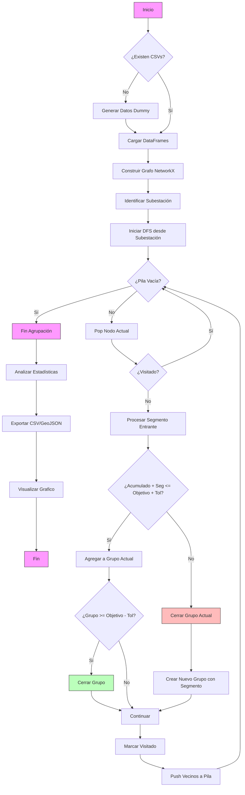

# Agrupación de Circuitos Eléctricos

Este proyecto implementa un algoritmo basado en **DFS (Depth-First Search)** y **NetworkX** para agrupar segmentos de una red eléctrica en tramos de aproximadamente **1 km**. 

Es útil para la gestión de activos, planificación de mantenimiento y análisis de redes de distribución de media tensión.

## 📋 Características

- **Carga de Datos**: Ingesta de datos desde archivos CSV (`segmentos_circuito.csv`, `nodos_circuito.csv`). Genera datos de prueba si no existen.
- **Modelado de Red**: Construcción de un grafo no dirigido ponderado utilizando `NetworkX`.
- **Agrupación Inteligente**: 
  - Utiliza un recorrido DFS para recorrer la red desde la subestación.
  - Agrupa segmentos contiguos hasta completar ~1 km (configurable).
  - Maneja tolerancias y ramificaciones.
- **Análisis y Estadísticas**: Calcula métricas de los grupos formados (min, max, promedio, desviación estándar).
- **Visualización**: Genera mapas de la red coloreados por grupos (`red_electrica_grupos.png`).
- **Exportación GIS**: Genera archivos GeoJSON para integración con sistemas GIS (QGIS, ArcGIS).

## 🚀 Requisitos

- Python 3.8+
- Librerías:
  - `pandas`
  - `networkx`
  - `matplotlib`
  - `numpy`
  - `geopandas` (para exportación GIS)
  - `shapely` (para geometrías GIS)

```bash
pip install pandas networkx matplotlib numpy geopandas shapely
```

## 🛠️ Uso

Ejecuta el script principal:

```bash
python agrupar_circuitos.py
```

El script verificará si existen los archivos de entrada. Si no, creará datos de ejemplo automáticamente.

### Salidas Generadas

1.  `grupos_1km.csv`: Tabla resumen de los grupos formados.
2.  `segmentos_con_grupo.csv`: Detalle de cada segmento con su ID de grupo asignado.
3.  `red_electrica_grupos.png`: Visualización gráfica de la red.
4.  `segmentos_con_grupos.geojson`: Archivo geoespacial para GIS.

## 🧩 Diagrama Funcional

El siguiente diagrama describe el flujo de lógica del algoritmo de agrupación:


