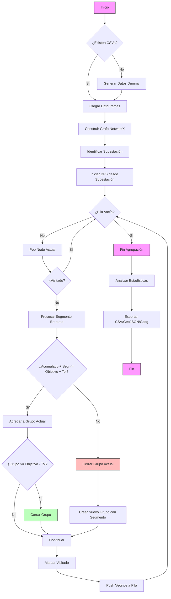

# Agrupación de Circuitos Eléctricos

Este proyecto implementa un algoritmo basado en **DFS (Depth-First Search)** y **NetworkX** para agrupar segmentos de una red eléctrica en tramos de aproximadamente **1 km**. 

Es útil para la gestión de activos, planificación de mantenimiento y análisis de redes de distribución de media tensión.

## 📋 Características

- **Carga de Datos**: 
  - Ingesta de datos desde archivos CSV (`segmentos_circuito.csv`, `nodos_circuito.csv`). Genera datos de prueba si no existen.
  - **🆕 Exportación desde Oracle**: Funcionalidad documentada para generar CSV desde base de datos Oracle (ver [Documentación Oracle](#-exportación-desde-oracle)).
- **Modelado de Red**: Construcción de un grafo no dirigido ponderado utilizando `NetworkX`.
- **Agrupación Inteligente**: 
  - Utiliza un recorrido DFS para recorrer la red desde la subestación.
  - Agrupa segmentos contiguos hasta completar ~1 km (configurable).
  - Maneja tolerancias y ramificaciones.
- **Análisis y Estadísticas**: Calcula métricas de los grupos formados (min, max, promedio, desviación estándar).
- **Exportación GIS**: Genera archivos GeoJSON para integración con sistemas GIS (QGIS, ArcGIS).

## 🚀 Requisitos

- Python 3.8+
- Librerías:
  - `pandas`
  - `networkx`
  - `numpy`
  - `geopandas` (para exportación GIS)
  - `shapely` (para geometrías GIS)

```bash
pip install pandas networkx numpy geopandas shapely
```

## 🛠️ Uso

Ejecuta el script principal:

```bash
python agrupar_circuitos.py
```

El script verificará si existen los archivos de entrada. Si no, creará datos de ejemplo automáticamente.

### Salidas Generadas

1.  `grupos_1km.csv`: Tabla resumen de los grupos formados.
2.  `segmentos_con_grupo.csv`: Detalle de cada segmento con su ID de grupo asignado.
3.  `segmentos_con_grupos.geojson`: Archivo geoespacial para GIS.

## 🧩 Diagrama Funcional

El siguiente diagrama describe el flujo de lógica del algoritmo de agrupación:



## 🔌 Exportación desde Oracle

Este proyecto incluye una funcionalidad de exportación de datos desde base de datos Oracle, que permite generar archivos CSV 100% compatibles con el formato esperado por `agrupar_circuitos.py`.

### Características Implementadas

- 📄 **Conexión a Oracle**: Mediante archivo de configuración `Connect.ini`
- 📦 **Ejecución de Package**: Ejecuta el package Oracle `AGRUPAR_CIRCUITOS`
- 📊 **Extracción de Datos**: Descarga información de tablas `HIT_NODE` y `HIT_LINE`
- 💾 **Generación de CSV**: Produce archivos `nodos_circuito.csv` y `segmentos_circuito.csv`
- 🎯 **Ejecución Standalone**: Puede ejecutarse independientemente o integrarse como módulo
- 🏗️ **Arquitectura Funcional**: Diseño modular con programación funcional

### Documentación Completa

Para detalles completos sobre arquitectura, implementación, configuración y uso, consultar:

📖 **[oracle_export_documentation.md](oracle_export_documentation.md)**

La documentación incluye:
- Arquitectura detallada del módulo
- Formato del archivo `Connect.ini`
- Especificaciones de cada componente funcional
- Mapeo de tablas Oracle → CSV
- Interfaz de línea de comandos
- Ejemplos de integración
- Casos de prueba
- Consideraciones de seguridad
- Diagramas de flujo y secuencia

### Requisitos

Para usar la exportación desde Oracle, se requiere:
- Oracle Instant Client
- Python 3.8+
- Librería `oracledb` (anteriormente `cx_Oracle`)
- Acceso a base de datos Oracle con tablas `HIT_NODE` y `HIT_LINE`
- Package Oracle `AGRUPAR_CIRCUITOS`

### Ejemplo de Uso

```bash
# Configurar conexión
cp Connect.ini.example Connect.ini
# Editar Connect.ini con credenciales

# Generar CSV desde Oracle
python oracle_export.py

# Usar con agrupar_circuitos.py
python agrupar_circuitos.py
```
