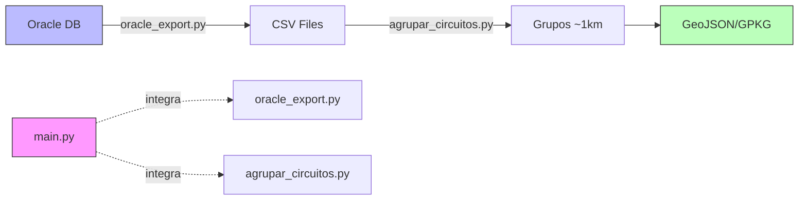

# Agrupación de Circuitos Eléctricos

Este proyecto implementa un algoritmo basado en **DFS (Depth-First Search)** y **NetworkX** para agrupar segmentos de una red eléctrica en tramos de aproximadamente **1 km**. 

Es útil para la gestión de activos, planificación de mantenimiento y análisis de redes de distribución de media tensión.

## 🏗️ Arquitectura del Proyecto

El proyecto está organizado en cuatro módulos principales que pueden funcionar de forma **standalone** o como **librerías**:

1. **`oracle_export.py`** - Exporta datos desde Oracle a CSV
   - ✅ Modo standalone: `python oracle_export.py --circuito "12 0m4n"`
   - ✅ Modo librería: `import oracle_export; oracle_export.export_from_oracle(...)`

2. **`agrupar_circuitos.py`** - Agrupa segmentos de circuitos en tramos de ~1km
   - ✅ Modo standalone: `python agrupar_circuitos.py --input-dir ./data`
   - ✅ Modo librería: `import agrupar_circuitos; agrupar_circuitos.main(...)`

3. **`graph_visualizer.py`** - 🆕 Genera visualización HTML interactiva de la red
   - ✅ Modo standalone: `python graph_visualizer.py --example`
   - ✅ Modo librería: `import graph_visualizer; graph_visualizer.main(...)`
   - 📖 [Ver documentación completa](README_graph_visualizer.md)
   - 🎨 Usa Cytoscape.js con layout cose-bilkent optimizado para redes eléctricas

4. **`main.py`** - Pipeline integrado completo (Oracle → Agrupación)
   - ✅ Modo standalone solamente: `python main.py --circuito "12 0m4n"`
   - ❌ No diseñado para importarse como librería

### Pipeline Integrado



## 📋 Características

- **Carga de Datos**: 
  - Ingesta de datos desde archivos CSV (`segmentos_circuito.csv`, `nodos_circuito.csv`). Genera datos de prueba si no existen.
  - **🆕 Exportación desde Oracle**: Funcionalidad documentada para generar CSV desde base de datos Oracle (ver [Documentación Oracle](#-exportación-desde-oracle)).
- **Modelado de Red**: Construcción de un grafo no dirigido ponderado utilizando `NetworkX`.
- **🆕 Dos Algoritmos de Agrupación**: 
  - **Algoritmo Lineal (DFS Secuencial)**: Recorre la red de forma secuencial y agrupa segmentos contiguos hasta completar ~1 km.
  - **Algoritmo Por Ramas**: Identifica primero las ramas de la red y agrupa segmentos dentro de cada rama independientemente.
  - Opción para ejecutar ambos algoritmos y comparar resultados.
- **Análisis y Estadísticas**: Calcula métricas de los grupos formados (min, max, promedio, desviación estándar).
- **Exportación GIS**: Genera archivos GeoJSON/Gpkg para integración con sistemas GIS (QGIS, ArcGIS).

## 🚀 Requisitos

- Python 3.8+
- Librerías:
  - `pandas`
  - `networkx`
  - `numpy`
  - `geopandas` (para exportación GIS)
  - `shapely` (para geometrías GIS)

```bash
pip install pandas networkx numpy geopandas shapely
```

## 🛠️ Uso

### 🚀 Pipeline Integrado (main.py)

**Recomendado**: Ejecuta el pipeline completo desde Oracle hasta la agrupación con un solo comando:

```bash
# Pipeline completo: Oracle → CSV → Agrupación
python main.py --circuito "12 0m4n"

# Omitir Oracle y usar CSV existentes
python main.py --circuito "12 0m4n" --skip-oracle

# Especificar directorio de salida
python main.py --circuito "MT-001" --output-dir ./resultados

# Modo verboso para debugging
python main.py --circuito "12 0m4n" --verbose
```

**Parámetros de main.py:**
- `--circuito` (REQUERIDO): Código del circuito a procesar
- `--config`: Ruta al archivo de configuración Oracle (default: `Connect.ini`)
- `--output-dir`: Directorio de salida (default: `./data`)
- `--skip-oracle`: Omitir exportación Oracle y usar CSV existentes
- `--verbose, -v`: Mostrar información detallada

### 📦 Uso Individual de Módulos

#### agrupar_circuitos.py (Standalone)

Ejecuta solo la agrupación con archivos CSV existentes:

```bash
python agrupar_circuitos.py
```

Por defecto, el script busca los archivos de entrada en `./data` y genera los archivos de salida en `./data`.

### Parámetros de Configuración

El script acepta los siguientes parámetros de línea de comandos:

- `--input-dir`: Directorio de entrada para archivos CSV (default: `./data`)
- `--output-dir`: Directorio de salida para archivos generados (default: `./data`)
- `--algoritmo`: Algoritmo de agrupación a usar (default: `lineal`)
  - `lineal`: DFS secuencial (algoritmo original)
  - `por-ramas`: DFS agrupando por ramas
  - `ambos`: Ejecuta ambos y compara resultados

### Ejemplos de Uso

```bash
# Usar directorios por defecto con algoritmo lineal (default)
python agrupar_circuitos.py

# Usar algoritmo por ramas
python agrupar_circuitos.py --algoritmo por-ramas

# Comparar ambos algoritmos
python agrupar_circuitos.py --algoritmo ambos

# Especificar directorio de entrada personalizado
python agrupar_circuitos.py --input-dir /ruta/a/datos/entrada --algoritmo por-ramas

# Especificar directorios de entrada y salida personalizados
python agrupar_circuitos.py --input-dir /ruta/entrada --output-dir /ruta/salida --algoritmo ambos

# Ver ayuda
python agrupar_circuitos.py --help
```

### Archivos de Entrada

El script requiere los siguientes archivos CSV en el directorio de entrada:

1. `segmentos_circuito.csv`: Contiene información de los segmentos de la red eléctrica
2. `nodos_circuito.csv`: Contiene información de los nodos de la red eléctrica

Si los archivos no existen, el script creará datos de ejemplo automáticamente.

### 🔀 Algoritmos de Agrupación

El proyecto incluye dos algoritmos de agrupación con diferentes enfoques:

#### Algoritmo Lineal (DFS Secuencial)

**Características:**
- Recorre la red de forma secuencial siguiendo el orden del DFS
- Agrupa segmentos contiguos hasta alcanzar ~1km
- Puede agrupar segmentos de diferentes ramas en el mismo grupo
- Más simple y directo
- Apropiado cuando la topología lineal es prioritaria

**Uso:**
```python
# Método en la clase RedElectrica
grupos = red.dfs_agrupar_segmentos(
    longitud_objetivo_m=1000.0,  # 1km
    tolerancia_km=0.2  # ±200m
)
```

#### Algoritmo Por Ramas

**Características:**
- Identifica primero todas las ramas de la red
- Agrupa segmentos dentro de cada rama independientemente
- Respeta los límites naturales de las ramas (derivaciones)
- Cada grupo pertenece a una sola rama
- Más apropiado para análisis por rama o gestión independiente de ramas
- Proporciona información adicional sobre la estructura de ramas (rama_id, nodo_inicio_rama, nodo_fin_rama)

**Uso:**
```python
# Método en la clase RedElectrica
grupos = red.dfs_por_ramas(
    longitud_objetivo_m=1000.0,  # 1km
    tolerancia_km=0.2  # ±200m
)
```

#### Comparación de Resultados

Cuando se usa `--algoritmo ambos`, el script genera un archivo `comparacion_algoritmos.txt` con:
- Estadísticas comparativas (número de grupos, longitudes, desviación estándar)
- Explicación de las diferencias clave entre ambos algoritmos
- Recomendaciones sobre cuándo usar cada uno

### Salidas Generadas

Todos los archivos de salida se generan en el directorio especificado por `--output-dir`:

1. `grupos_1km.csv`: Tabla resumen de los grupos formados.
2. `segmentos_con_grupo.csv`: Detalle de cada segmento con su ID de grupo asignado.
3. `segmentos_con_grupos.geojson`: Archivo geoespacial en formato GeoJSON para GIS.
4. `segmentos_con_grupos.gpkg`: Archivo geoespacial en formato GeoPackage para GIS.

## 📚 Uso como Librería

Los módulos `oracle_export.py` y `agrupar_circuitos.py` pueden importarse y usarse como librerías en tus propios scripts:

### Ejemplo 1: Usar oracle_export.py como librería

```python
import oracle_export

# Opción 1: Obtener rutas de archivos CSV generados
files = oracle_export.export_from_oracle(
    config_file='Connect.ini',
    circuito='12 0m4n'
)
print(f"Nodos: {files['nodes']}")
print(f"Segmentos: {files['lines']}")

# Opción 2: Obtener DataFrames directamente
df_nodos, df_segmentos = oracle_export.export_from_oracle(
    config_file='Connect.ini',
    circuito='12 0m4n',
    return_dataframes=True
)
print(f"Total nodos: {len(df_nodos)}")
print(f"Total segmentos: {len(df_segmentos)}")
```

### Ejemplo 2: Usar agrupar_circuitos.py como librería

```python
import agrupar_circuitos

# Opción 1: Ejecutar agrupación con algoritmo lineal (default)
result = agrupar_circuitos.main(
    input_dir='./data',
    output_dir='./data',
    algoritmo='lineal'  # 'lineal', 'por-ramas', o 'ambos'
)

if result['success']:
    print(f"Algoritmo usado: {result['algoritmo']}")
    print(f"Grupos generados: {result['stats']['num_grupos']}")
    print(f"Segmentos procesados: {result['stats']['num_segmentos']}")
    
    # Acceder al grafo NetworkX
    red = result['red']
    print(f"Nodos en grafo: {red.G.number_of_nodes()}")
    
    # Acceder a los grupos
    for grupo_id, info in result['grupos'].items():
        print(f"Grupo {grupo_id}: {info['longitud_km']:.2f} km")
        # Si usaste 'por-ramas', también puedes acceder a:
        if 'rama_id' in info:
            print(f"  Pertenece a Rama {info['rama_id']}")
else:
    print(f"Error: {result['error']}")

# Opción 2: Usar métodos directamente en la clase RedElectrica
from agrupar_circuitos import RedElectrica, cargar_datos_csv

df_segmentos, df_nodos = cargar_datos_csv('./data')
red = RedElectrica()
red.cargar_datos(df_segmentos, df_nodos)

# Ejecutar algoritmo por ramas
grupos_por_rama = red.dfs_por_ramas(
    longitud_objetivo_m=1000.0,
    tolerancia_km=0.2
)

# O ejecutar algoritmo lineal
grupos_lineal = red.dfs_agrupar_segmentos(
    longitud_objetivo_m=1000.0,
    tolerancia_km=0.2
)
```

### Ejemplo 3: Pipeline completo programático

```python
import oracle_export
import agrupar_circuitos

# Paso 1: Exportar desde Oracle
print("Exportando desde Oracle...")
df_nodos, df_segmentos = oracle_export.export_from_oracle(
    config_file='Connect.ini',
    circuito='12 0m4n',
    return_dataframes=True
)

# Paso 2: Agrupar circuitos
print("Agrupando circuitos...")
result = agrupar_circuitos.main(
    input_dir='./data',
    output_dir='./data'
)

# Paso 3: Procesar resultados
if result['success']:
    print(f"✅ Pipeline completado")
    print(f"   Grupos: {result['stats']['num_grupos']}")
    print(f"   Archivos: {result['files']}")
```

**Nota**: `main.py` está diseñado **ÚNICAMENTE** para ejecución standalone y no debe importarse como librería. Para uso programático, importar `oracle_export` y `agrupar_circuitos` directamente.

## 🧩 Diagrama Funcional

El siguiente diagrama describe el flujo de lógica del algoritmo de agrupación:


## 🔌 Exportación desde Oracle

Este proyecto incluye una funcionalidad de exportación de datos desde base de datos Oracle, que permite generar archivos CSV 100% compatibles con el formato esperado por `agrupar_circuitos.py`.

### Características Implementadas

- 📄 **Conexión a Oracle**: Mediante archivo de configuración `Connect.ini`
- 📦 **Ejecución de Package**: Ejecuta el package Oracle `AGRUPAR_CIRCUITOS`
- 📊 **Extracción de Datos**: Descarga información de tablas `HIT_NODE` y `HIT_LINE`
- 💾 **Generación de CSV**: Produce archivos `nodos_circuito.csv` y `segmentos_circuito.csv`
- 🎯 **Ejecución Standalone**: Puede ejecutarse independientemente o integrarse como módulo
- 🏗️ **Arquitectura Funcional**: Diseño modular con programación funcional

### Documentación Completa

Para detalles completos sobre arquitectura, implementación, configuración y uso, consultar:

📖 **[oracle_export_documentation.md](oracle_export_documentation.md)**

La documentación incluye:
- Arquitectura detallada del módulo
- Formato del archivo `Connect.ini`
- Especificaciones de cada componente funcional
- Mapeo de tablas Oracle → CSV
- Interfaz de línea de comandos
- Ejemplos de integración
- Casos de prueba
- Consideraciones de seguridad
- Diagramas de flujo y secuencia

### Requisitos

Para usar la exportación desde Oracle, se requiere:
- Oracle Instant Client
- Python 3.8+
- Librería `oracledb` (anteriormente `cx_Oracle`)
- Acceso a base de datos Oracle con tablas `HIT_NODE` y `HIT_LINE`
- Package Oracle `AGRUPAR_CIRCUITOS`

### Ejemplo de Uso

```bash
# Configurar conexión
cp Connect.ini.example Connect.ini
# Editar Connect.ini con credenciales

# Opción 1: Pipeline integrado (RECOMENDADO)
python main.py --circuito "12 0m4n"

# Opción 2: Módulos individuales
# Paso 1: Generar CSV desde Oracle
python oracle_export.py --circuito "12 0m4n" --output-dir ./data

# Paso 2: Agrupar circuitos
python agrupar_circuitos.py --input-dir ./data --output-dir ./data
```

### Integración

Los módulos están diseñados para trabajar juntos:

1. **`main.py`** proporciona un pipeline completo y simplificado
2. **`oracle_export.py`** y **`agrupar_circuitos.py`** pueden usarse independientemente o como librerías
3. Todos los módulos generan archivos CSV compatibles entre sí

## 🎨 Visualización de Grafos (NUEVO)

El proyecto ahora incluye una **herramienta independiente de visualización** que genera gráficos HTML interactivos de la red eléctrica.

### Características de Graph Visualizer

- 🎯 **Totalmente Independiente**: No interfiere con el proceso de agrupación existente
- 🎨 **Visualización Interactiva**: Usa Cytoscape.js para crear gráficos HTML navegables
- 🔍 **Información Detallada**: Panel lateral con estadísticas completas del grafo
- 🎨 **Código de Colores**: Diferentes colores para tipos de nodos (Subestación, Apoyo, Transformador, Derivación)
- 📊 **Estadísticas del Grafo**: Muestra propiedades topológicas y métricas de la red
- 📁 **Salida Separada**: Guarda archivos en directorio `graph_output/` independiente
- 🆓 **Open Source**: Usa bibliotecas libres (NetworkX, Cytoscape.js)
- 🎯 **Layout Optimizado**: Usa algoritmo cose-bilkent, ideal para redes eléctricas jerárquicas

### Uso Rápido

```bash
# Instalar dependencias
pip install -r requirements_graph.txt

# Usar datos de ejemplo
python graph_visualizer.py --example

# Usar archivos CSV existentes
python graph_visualizer.py --input-dir ./data

# Personalizar salida
python graph_visualizer.py --output-dir ./mis_grafos
```

### Documentación Completa

Para información detallada sobre el visualizador de grafos, consulta:

📖 **[README_graph_visualizer.md](README_graph_visualizer.md)**

La documentación incluye:
- Características detalladas
- Instrucciones de instalación
- Ejemplos de uso
- Formato de archivos de entrada/salida
- Uso como librería Python
- Casos de uso y ejemplos
- Solución de problemas

### Ejemplo de Integración

Puedes combinar el visualizador con el pipeline existente:

```bash
# Paso 1: Exportar datos desde Oracle (opcional)
python oracle_export.py --circuito "12 0m4n" --output-dir ./data

# Paso 2: Agrupar circuitos
python agrupar_circuitos.py --input-dir ./data --output-dir ./data

# Paso 3: Generar visualización HTML
python graph_visualizer.py --input-dir ./data --output-dir ./graph_output
```

O usar todo el pipeline integrado y luego visualizar:

```bash
# Pipeline completo
python main.py --circuito "12 0m4n"

# Generar visualización
python graph_visualizer.py --input-dir ./data
```
