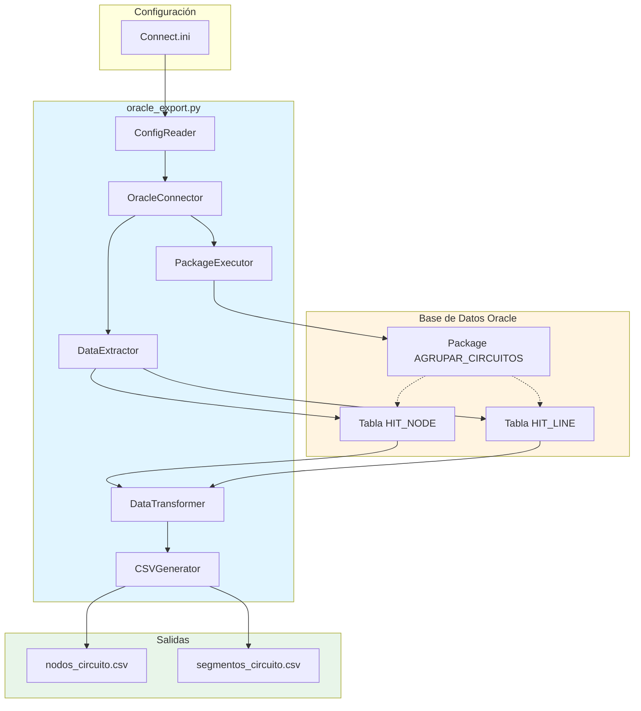
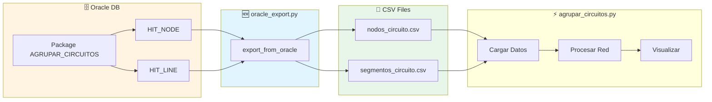

# Documentación: Funcionalidad de Exportación CSV desde Oracle

## 📋 Resumen Ejecutivo

Esta documentación describe la funcionalidad diseñada para generar archivos CSV compatibles con `agrupar_circuitos.py` a partir de datos almacenados en una base de datos Oracle. La solución permite ejecutarse de forma **standalone** o integrarse como módulo en el flujo de trabajo existente.

**Estado**: ⚠️ **DOCUMENTADO - NO IMPLEMENTADO**

---

## 🎯 Objetivos

1. Conectar a base de datos Oracle mediante archivo de configuración `Connect.ini`
2. Ejecutar el package Oracle `AGRUPAR_CIRCUITOS`
3. Extraer datos de las tablas `HIT_NODE` y `HIT_LINE`
4. Generar archivos CSV 100% compatibles con el formato actual:
   - `nodos_circuito.csv`
   - `segmentos_circuito.csv`
5. Utilizar programación funcional y arquitectura modular
6. Permitir ejecución standalone y como módulo exportable

---

## 🏗️ Arquitectura del Módulo

### Estructura de Archivos Propuesta

```
agrupar_circuitos/
├── agrupar_circuitos.py          # Script principal existente
├── oracle_export.py              # Nuevo módulo de exportación (STANDALONE)
├── Connect.ini                   # Archivo de configuración Oracle
├── nodos_circuito.csv           # Salida generada
├── segmentos_circuito.csv       # Salida generada
├── README.md                     # Documentación actualizada
└── oracle_export_documentation.md  # Este documento
```

### Diagrama de Arquitectura



---

## 📄 Archivo Connect.ini

### Formato del Archivo

El archivo `Connect.ini` debe seguir el formato estándar INI con la siguiente estructura:

```ini
[ORACLE]
# Configuración de conexión a Oracle
host = servidor.empresa.com
port = 1521
service_name = ORCL
username = usuario_app
# password = contraseña_app  # Opcional - mejor usar wallet
wallet_location = /ruta/a/wallet

[DATABASE]
# Nombres de objetos en la base de datos
package_name = AGRUPAR_CIRCUITOS
node_table = HIT_NODE
line_table = HIT_LINE
schema = ESQUEMA_ELECTRICO

[OUTPUT]
# Configuración de archivos de salida
output_dir = ./
node_csv = nodos_circuito.csv
segment_csv = segmentos_circuito.csv
encoding = utf-8

[LOGGING]
# Configuración de logging
log_level = INFO
log_file = oracle_export.log
```

### Seguridad

**IMPORTANTE**: Por seguridad, se recomienda:
- **NO almacenar contraseñas en texto plano** en `Connect.ini`
- Usar **Oracle Wallet** para credenciales
- Alternativamente, solicitar contraseña en tiempo de ejecución
- Proteger el archivo con permisos restrictivos: `chmod 600 Connect.ini`

---

## 🔌 Módulo 1: Configuración (ConfigReader)

### Responsabilidad
Leer y validar la configuración del archivo `Connect.ini`.

### Interfaz Funcional

```python
def read_config(config_file: str = "Connect.ini") -> Dict[str, Any]:
    """
    Lee y valida el archivo de configuración.
    
    Args:
        config_file: Ruta al archivo de configuración
        
    Returns:
        Diccionario con configuración validada
        
    Raises:
        FileNotFoundError: Si el archivo no existe
        ConfigurationError: Si faltan parámetros obligatorios
    """
    pass

def validate_config(config: Dict[str, Any]) -> bool:
    """
    Valida que todos los parámetros obligatorios estén presentes.
    
    Args:
        config: Diccionario de configuración
        
    Returns:
        True si la configuración es válida
        
    Raises:
        ConfigurationError: Si hay errores en la configuración
    """
    pass
```

### Parámetros Obligatorios
- `host`, `port`, `service_name`
- `package_name`, `node_table`, `line_table`
- Credenciales (password o wallet_location)

---

## 🔗 Módulo 2: Conexión Oracle (OracleConnector)

### Responsabilidad
Establecer y gestionar la conexión con Oracle.

### Dependencias Requeridas
```bash
pip install cx_Oracle  # Driver oficial de Oracle
```

**Nota**: Requiere Oracle Instant Client instalado en el sistema.

### Interfaz Funcional

```python
def create_connection(config: Dict[str, Any]) -> cx_Oracle.Connection:
    """
    Establece conexión con la base de datos Oracle.
    
    Args:
        config: Diccionario con parámetros de conexión
        
    Returns:
        Objeto de conexión Oracle
        
    Raises:
        OracleConnectionError: Si falla la conexión
    """
    pass

def test_connection(conn: cx_Oracle.Connection) -> bool:
    """
    Verifica que la conexión esté activa.
    
    Args:
        conn: Conexión a Oracle
        
    Returns:
        True si la conexión es exitosa
    """
    pass

def close_connection(conn: cx_Oracle.Connection) -> None:
    """
    Cierra la conexión de forma segura.
    
    Args:
        conn: Conexión a cerrar
    """
    pass
```

### Gestión de Contexto

Se recomienda implementar un context manager:

```python
@contextmanager
def oracle_connection(config: Dict[str, Any]) -> Generator[cx_Oracle.Connection, None, None]:
    """
    Context manager para gestión automática de conexión.
    
    Uso:
        with oracle_connection(config) as conn:
            # Usar conexión
            pass
    """
    pass
```

---

## 📦 Módulo 3: Ejecución de Package (PackageExecutor)

### Responsabilidad
Ejecutar el package Oracle `AGRUPAR_CIRCUITOS`.

### Interfaz Funcional

```python
def execute_package(
    conn: cx_Oracle.Connection,
    package_name: str,
    schema: str = None
) -> bool:
    """
    Ejecuta el package Oracle especificado.
    
    Args:
        conn: Conexión activa a Oracle
        package_name: Nombre del package a ejecutar (ej. "AGRUPAR_CIRCUITOS")
        schema: Esquema donde está el package (opcional)
        
    Returns:
        True si la ejecución fue exitosa
        
    Raises:
        PackageExecutionError: Si falla la ejecución del package
        
    Notas:
        - El package debe existir en la base de datos
        - Debe tener los permisos necesarios para ejecutarlo
        - Puede tener parámetros IN/OUT según diseño del package
    """
    pass

def check_package_exists(
    conn: cx_Oracle.Connection,
    package_name: str,
    schema: str = None
) -> bool:
    """
    Verifica si el package existe en la base de datos.
    
    Args:
        conn: Conexión activa a Oracle
        package_name: Nombre del package
        schema: Esquema del package
        
    Returns:
        True si el package existe
    """
    pass
```

### Consideraciones

1. **Sintaxis de Ejecución**: 
   ```sql
   BEGIN
       ESQUEMA_ELECTRICO.AGRUPAR_CIRCUITOS;
   END;
   ```

2. **Parámetros del Package**: 
   - Si el package requiere parámetros, estos deben ser documentados
   - No se asumen parámetros según requerimiento #6

3. **Manejo de Errores**:
   - Capturar errores Oracle específicos
   - Proporcionar mensajes descriptivos

---

## 📊 Módulo 4: Extracción de Datos (DataExtractor)

### Responsabilidad
Extraer datos de las tablas `HIT_NODE` y `HIT_LINE` mediante consultas SQL.

### Mapeo de Tablas Oracle → CSV

#### Tabla HIT_NODE → nodos_circuito.csv

**Campos Requeridos en CSV:**
| Campo CSV    | Tipo    | Descripción                          |
|--------------|---------|--------------------------------------|
| id_nodo      | int/str | Identificador único del nodo         |
| nombre       | str     | Nombre descriptivo del nodo          |
| tipo         | str     | Tipo: Subestacion, Apoyo, etc.       |
| voltaje_kv   | float   | Voltaje en kilovoltios               |
| x            | float   | Coordenada X (longitud)              |
| y            | float   | Coordenada Y (latitud)               |

**Query SQL Sugerida:**
```sql
SELECT 
    node_id AS id_nodo,
    node_name AS nombre,
    node_type AS tipo,
    voltage_kv AS voltaje_kv,
    coord_x AS x,
    coord_y AS y
FROM HIT_NODE
WHERE <condiciones_de_filtro>
ORDER BY node_id
```

#### Tabla HIT_LINE → segmentos_circuito.csv

**Campos Requeridos en CSV:**
| Campo CSV       | Tipo    | Descripción                          |
|-----------------|---------|--------------------------------------|
| id_segmento     | int     | Identificador único del segmento     |
| id_circuito     | str     | Identificador del circuito           |
| nodo_inicio     | int/str | ID del nodo de inicio                |
| nodo_fin        | int/str | ID del nodo de fin                   |
| longitud_m      | float   | Longitud del segmento en metros      |
| tipo_conductor  | str     | Tipo de conductor (ej. AAC_150)      |
| capacidad_amp   | int     | Capacidad en amperios                |

**Query SQL Sugerida:**
```sql
SELECT 
    line_id AS id_segmento,
    circuit_id AS id_circuito,
    from_node_id AS nodo_inicio,
    to_node_id AS nodo_fin,
    length_m AS longitud_m,
    conductor_type AS tipo_conductor,
    ampacity AS capacidad_amp
FROM HIT_LINE
WHERE <condiciones_de_filtro>
ORDER BY line_id
```

### Interfaz Funcional

```python
def extract_nodes(
    conn: cx_Oracle.Connection,
    table_name: str = "HIT_NODE",
    schema: str = None
) -> pd.DataFrame:
    """
    Extrae datos de nodos desde Oracle.
    
    Args:
        conn: Conexión activa a Oracle
        table_name: Nombre de la tabla de nodos
        schema: Esquema de la tabla
        
    Returns:
        DataFrame con columnas: id_nodo, nombre, tipo, voltaje_kv, x, y
        
    Raises:
        DataExtractionError: Si falla la consulta
    """
    pass

def extract_lines(
    conn: cx_Oracle.Connection,
    table_name: str = "HIT_LINE",
    schema: str = None
) -> pd.DataFrame:
    """
    Extrae datos de líneas/segmentos desde Oracle.
    
    Args:
        conn: Conexión activa a Oracle
        table_name: Nombre de la tabla de líneas
        schema: Esquema de la tabla
        
    Returns:
        DataFrame con columnas: id_segmento, id_circuito, nodo_inicio, 
                               nodo_fin, longitud_m, tipo_conductor, capacidad_amp
        
    Raises:
        DataExtractionError: Si falla la consulta
    """
    pass

def extract_data(
    conn: cx_Oracle.Connection,
    config: Dict[str, Any]
) -> Tuple[pd.DataFrame, pd.DataFrame]:
    """
    Extrae ambas tablas (nodos y líneas).
    
    Args:
        conn: Conexión activa a Oracle
        config: Configuración con nombres de tablas
        
    Returns:
        Tupla (df_nodos, df_segmentos)
    """
    pass
```

### Consideraciones Importantes

1. **Nombres de Columnas**: 
   - Los nombres reales en Oracle pueden diferir
   - Se debe documentar el mapeo real al implementar
   - Cumplir con requerimiento #6: no asumir nombres

2. **Filtros**:
   - Puede ser necesario filtrar por circuito específico
   - Filtrar datos activos vs. históricos
   - Considerar filtros por región/zona

3. **Performance**:
   - Para grandes volúmenes, usar `chunksize` en pandas
   - Considerar índices en Oracle

---

## 🔄 Módulo 5: Transformación de Datos (DataTransformer)

### Responsabilidad
Transformar y validar los datos extraídos para asegurar compatibilidad 100% con el formato esperado.

### Interfaz Funcional

```python
def transform_nodes(df_raw: pd.DataFrame) -> pd.DataFrame:
    """
    Transforma DataFrame de nodos al formato esperado.
    
    Transformaciones:
    - Renombrar columnas si es necesario
    - Convertir tipos de datos
    - Validar campos obligatorios
    - Limpiar valores nulos o inválidos
    
    Args:
        df_raw: DataFrame con datos crudos de Oracle
        
    Returns:
        DataFrame transformado con formato correcto
        
    Raises:
        DataValidationError: Si hay datos inválidos
    """
    pass

def transform_lines(df_raw: pd.DataFrame) -> pd.DataFrame:
    """
    Transforma DataFrame de líneas al formato esperado.
    
    Transformaciones:
    - Renombrar columnas si es necesario
    - Convertir tipos de datos
    - Validar campos obligatorios
    - Asegurar integridad referencial con nodos
    
    Args:
        df_raw: DataFrame con datos crudos de Oracle
        
    Returns:
        DataFrame transformado con formato correcto
        
    Raises:
        DataValidationError: Si hay datos inválidos
    """
    pass

def validate_data_integrity(
    df_nodes: pd.DataFrame,
    df_lines: pd.DataFrame
) -> Tuple[bool, List[str]]:
    """
    Valida integridad referencial entre nodos y líneas.
    
    Validaciones:
    - Todos los nodos referenciados en líneas existen
    - No hay duplicados en id_nodo o id_segmento
    - Campos obligatorios no nulos
    - Tipos de datos correctos
    - Valores en rangos válidos (ej. longitud_m > 0)
    
    Args:
        df_nodes: DataFrame de nodos
        df_lines: DataFrame de líneas
        
    Returns:
        Tupla (es_valido, lista_de_errores)
    """
    pass
```

### Reglas de Validación

#### Nodos
- `id_nodo`: Único, no nulo
- `nombre`: No nulo, longitud < 255
- `tipo`: Debe estar en ['Subestacion', 'Apoyo', 'Derivacion', 'Transformador']
- `voltaje_kv`: Numérico positivo
- `x`, `y`: Coordenadas válidas (no 0,0 a menos que sea legítimo)

#### Segmentos/Líneas
- `id_segmento`: Único, no nulo
- `id_circuito`: No nulo
- `nodo_inicio`, `nodo_fin`: Deben existir en tabla de nodos
- `nodo_inicio != nodo_fin`: No permitir self-loops
- `longitud_m`: Positivo, típicamente > 0 y < 10000
- `tipo_conductor`: No nulo
- `capacidad_amp`: Positivo

---

## 💾 Módulo 6: Generación de CSV (CSVGenerator)

### Responsabilidad
Escribir los DataFrames transformados a archivos CSV en el formato exacto esperado.

### Interfaz Funcional

```python
def write_csv(
    df: pd.DataFrame,
    filename: str,
    output_dir: str = "./",
    encoding: str = "utf-8"
) -> str:
    """
    Escribe DataFrame a archivo CSV.
    
    Args:
        df: DataFrame a exportar
        filename: Nombre del archivo CSV
        output_dir: Directorio de salida
        encoding: Codificación del archivo
        
    Returns:
        Ruta completa del archivo generado
        
    Raises:
        CSVWriteError: Si falla la escritura
    """
    pass

def generate_csv_files(
    df_nodes: pd.DataFrame,
    df_lines: pd.DataFrame,
    config: Dict[str, Any]
) -> Dict[str, str]:
    """
    Genera ambos archivos CSV.
    
    Args:
        df_nodes: DataFrame de nodos
        df_lines: DataFrame de líneas
        config: Configuración con rutas de salida
        
    Returns:
        Diccionario con rutas de archivos generados:
        {'nodes': 'ruta/nodos_circuito.csv', 
         'lines': 'ruta/segmentos_circuito.csv'}
    """
    pass

def verify_csv_format(csv_file: str, expected_columns: List[str]) -> bool:
    """
    Verifica que el CSV generado tenga el formato correcto.
    
    Args:
        csv_file: Ruta al archivo CSV
        expected_columns: Lista de columnas esperadas
        
    Returns:
        True si el formato es correcto
    """
    pass
```

### Formato CSV Exacto

**Características del formato:**
- **Delimitador**: Coma (`,`)
- **Encoding**: UTF-8 (sin BOM)
- **Cabecera**: Primera línea con nombres de columnas
- **Quotes**: Solo cuando sea necesario (ej. valores con comas)
- **Saltos de línea**: LF (`\n`) en Unix, CRLF (`\r\n`) en Windows

**Ejemplo nodos_circuito.csv:**
```csv
id_nodo,nombre,tipo,voltaje_kv,x,y
1001,Subestacion_Principal,Subestacion,34.5,-70.65,-33.45
1002,Apoyo_MT_001,Apoyo,34.5,-70.651,-33.451
```

**Ejemplo segmentos_circuito.csv:**
```csv
id_segmento,id_circuito,nodo_inicio,nodo_fin,longitud_m,tipo_conductor,capacidad_amp
0,MT-001,1001,1002,523.5,AAC_150,250
1,MT-001,1002,1003,478.2,AAC_150,250
```

---

## 🚀 Modo de Ejecución

### 1. Ejecución Standalone

El módulo debe poder ejecutarse de forma independiente como script:

```bash
# Ejecución básica (usa Connect.ini por defecto)
python oracle_export.py

# Con archivo de configuración personalizado
python oracle_export.py --config /ruta/a/config.ini

# Con opciones adicionales
python oracle_export.py --config Connect.ini --output-dir ./data --verbose
```

### Interfaz de Línea de Comandos

```python
def main():
    """
    Función principal para ejecución standalone.
    
    Argumentos CLI:
        --config: Ruta al archivo Connect.ini (default: "./Connect.ini")
        --output-dir: Directorio para archivos CSV (default: "./")
        --verbose: Modo verboso de logging
        --dry-run: Simular ejecución sin escribir archivos
        --skip-package: No ejecutar package Oracle
    """
    pass
```

**Ejemplo de uso:**

```bash
$ python oracle_export.py --config Connect.ini --verbose

[INFO] Iniciando exportación desde Oracle...
[INFO] Leyendo configuración desde Connect.ini
[INFO] Conectando a Oracle: servidor.empresa.com:1521/ORCL
[INFO] ✓ Conexión establecida
[INFO] Ejecutando package: AGRUPAR_CIRCUITOS
[INFO] ✓ Package ejecutado exitosamente
[INFO] Extrayendo datos de tabla HIT_NODE...
[INFO] ✓ 1,250 nodos extraídos
[INFO] Extrayendo datos de tabla HIT_LINE...
[INFO] ✓ 3,847 segmentos extraídos
[INFO] Transformando y validando datos...
[INFO] ✓ Validación exitosa - Integridad referencial OK
[INFO] Generando archivos CSV...
[INFO] ✓ nodos_circuito.csv generado (1,250 registros)
[INFO] ✓ segmentos_circuito.csv generado (3,847 registros)
[INFO] Proceso completado exitosamente en 12.3s
```

### 2. Integración como Módulo

El código debe ser importable desde `agrupar_circuitos.py`:

```python
# En agrupar_circuitos.py

# Importar funcionalidad de exportación Oracle
from oracle_export import export_from_oracle

def main():
    """Función principal modificada para soportar múltiples fuentes de datos"""
    
    # Opción 1: Cargar desde CSV existente (comportamiento actual)
    if os.path.exists('nodos_circuito.csv'):
        df_nodos = pd.read_csv('nodos_circuito.csv')
        df_segmentos = pd.read_csv('segmentos_circuito.csv')
    
    # Opción 2: Generar desde Oracle
    else:
        print("📥 Generando CSV desde base de datos Oracle...")
        df_nodos, df_segmentos = export_from_oracle('Connect.ini')
    
    # Continuar con el proceso normal...
    red = RedElectrica()
    red.cargar_datos(df_segmentos, df_nodos)
    # ...
```

### Interfaz Pública del Módulo

```python
# oracle_export.py

def export_from_oracle(
    config_file: str = "Connect.ini",
    return_dataframes: bool = False
) -> Union[Dict[str, str], Tuple[pd.DataFrame, pd.DataFrame]]:
    """
    Función pública principal para exportación desde Oracle.
    
    Esta es la función que se importará en otros módulos.
    
    Args:
        config_file: Ruta al archivo de configuración
        return_dataframes: Si True, retorna DataFrames en lugar de rutas
        
    Returns:
        Si return_dataframes=False:
            Dict con rutas de archivos: {'nodes': path, 'lines': path}
        Si return_dataframes=True:
            Tupla (df_nodos, df_segmentos)
            
    Ejemplo:
        # Generar archivos CSV
        files = export_from_oracle('Connect.ini')
        print(f"Archivos generados: {files}")
        
        # Obtener DataFrames directamente
        df_nodos, df_segmentos = export_from_oracle(
            'Connect.ini', 
            return_dataframes=True
        )
    """
    pass
```

---

## 🔧 Pipeline de Ejecución Completo

### Flujo de Trabajo

```mermaid
sequenceDiagram
    participant User
    participant CLI as oracle_export.py
    participant Config as ConfigReader
    participant Oracle as OracleConnector
    participant Pkg as PackageExecutor
    participant Extract as DataExtractor
    participant Transform as DataTransformer
    participant CSV as CSVGenerator
    participant FS as FileSystem

    User->>CLI: python oracle_export.py
    CLI->>Config: read_config("Connect.ini")
    Config-->>CLI: config_dict
    CLI->>Config: validate_config(config_dict)
    Config-->>CLI: ✓ válido
    
    CLI->>Oracle: create_connection(config)
    Oracle-->>CLI: connection
    CLI->>Oracle: test_connection(connection)
    Oracle-->>CLI: ✓ OK
    
    CLI->>Pkg: execute_package(connection, "AGRUPAR_CIRCUITOS")
    Pkg->>Oracle: BEGIN package.procedure; END;
    Oracle-->>Pkg: ✓ ejecutado
    Pkg-->>CLI: success
    
    CLI->>Extract: extract_data(connection, config)
    Extract->>Oracle: SELECT * FROM HIT_NODE
    Oracle-->>Extract: resultset_nodes
    Extract->>Oracle: SELECT * FROM HIT_LINE
    Oracle-->>Extract: resultset_lines
    Extract-->>CLI: (df_nodes_raw, df_lines_raw)
    
    CLI->>Transform: transform_nodes(df_nodes_raw)
    Transform-->>CLI: df_nodes
    CLI->>Transform: transform_lines(df_lines_raw)
    Transform-->>CLI: df_lines
    CLI->>Transform: validate_data_integrity(df_nodes, df_lines)
    Transform-->>CLI: (True, [])
    
    CLI->>CSV: generate_csv_files(df_nodes, df_lines, config)
    CSV->>FS: write nodos_circuito.csv
    FS-->>CSV: ✓ escrito
    CSV->>FS: write segmentos_circuito.csv
    FS-->>CSV: ✓ escrito
    CSV-->>CLI: {'nodes': path1, 'lines': path2}
    
    CLI->>Oracle: close_connection(connection)
    Oracle-->>CLI: ✓ cerrado
    
    CLI-->>User: ✓ Proceso completado
```

### Función Orquestadora

```python
def oracle_to_csv_pipeline(config_file: str = "Connect.ini") -> Dict[str, Any]:
    """
    Pipeline completo de extracción Oracle → CSV.
    
    Este es el flujo principal que coordina todos los módulos.
    
    Args:
        config_file: Ruta al archivo de configuración
        
    Returns:
        Diccionario con resultados:
        {
            'success': bool,
            'files': {'nodes': path, 'lines': path},
            'stats': {
                'nodes_count': int,
                'lines_count': int,
                'execution_time': float
            },
            'errors': List[str]
        }
        
    Flujo:
        1. Leer configuración
        2. Conectar a Oracle
        3. Ejecutar package AGRUPAR_CIRCUITOS
        4. Extraer datos de HIT_NODE y HIT_LINE
        5. Transformar y validar datos
        6. Generar archivos CSV
        7. Cerrar conexión
    """
    
    start_time = time.time()
    result = {
        'success': False,
        'files': {},
        'stats': {},
        'errors': []
    }
    
    try:
        # 1. Configuración
        config = read_config(config_file)
        validate_config(config)
        
        # 2. Conexión
        with oracle_connection(config) as conn:
            
            # 3. Ejecutar package
            execute_package(conn, config['package_name'], config.get('schema'))
            
            # 4. Extraer datos
            df_nodes_raw, df_lines_raw = extract_data(conn, config)
            
            # 5. Transformar y validar
            df_nodes = transform_nodes(df_nodes_raw)
            df_lines = transform_lines(df_lines_raw)
            
            is_valid, errors = validate_data_integrity(df_nodes, df_lines)
            if not is_valid:
                raise DataValidationError(f"Errores de validación: {errors}")
            
            # 6. Generar CSV
            files = generate_csv_files(df_nodes, df_lines, config)
            
            # 7. Estadísticas
            result['success'] = True
            result['files'] = files
            result['stats'] = {
                'nodes_count': len(df_nodes),
                'lines_count': len(df_lines),
                'execution_time': time.time() - start_time
            }
            
    except Exception as e:
        result['errors'].append(str(e))
        logging.error(f"Error en pipeline: {e}", exc_info=True)
    
    return result
```

---

## 🧪 Casos de Prueba Recomendados

### Tests Unitarios

```python
# test_oracle_export.py

class TestConfigReader:
    """Tests para lectura de configuración"""
    
    def test_read_valid_config(self):
        """Debe leer correctamente un archivo válido"""
        pass
    
    def test_missing_config_file(self):
        """Debe lanzar FileNotFoundError si no existe"""
        pass
    
    def test_invalid_config_missing_required(self):
        """Debe lanzar error si faltan parámetros obligatorios"""
        pass

class TestOracleConnector:
    """Tests para conexión Oracle"""
    
    @patch('cx_Oracle.connect')
    def test_successful_connection(self, mock_connect):
        """Debe conectar exitosamente con credenciales válidas"""
        pass
    
    def test_connection_failure(self):
        """Debe manejar errores de conexión"""
        pass

class TestDataTransformer:
    """Tests para transformación de datos"""
    
    def test_transform_nodes_valid_data(self):
        """Debe transformar correctamente datos válidos"""
        pass
    
    def test_validate_referential_integrity_fails(self):
        """Debe detectar nodos referenciados inexistentes"""
        pass
    
    def test_detect_duplicate_ids(self):
        """Debe detectar IDs duplicados"""
        pass

class TestCSVGenerator:
    """Tests para generación de CSV"""
    
    def test_csv_format_matches_expected(self):
        """El CSV debe coincidir exactamente con el formato esperado"""
        pass
    
    def test_encoding_utf8(self):
        """Archivos deben estar en UTF-8"""
        pass
```

### Tests de Integración

```python
class TestIntegration:
    """Tests de integración con base de datos de prueba"""
    
    @pytest.mark.integration
    def test_full_pipeline_with_test_db(self):
        """Pipeline completo contra BD de pruebas"""
        pass
    
    @pytest.mark.integration
    def test_compatibility_with_agrupar_circuitos(self):
        """Los CSV generados deben funcionar con agrupar_circuitos.py"""
        pass
```

---

## 📝 Logging y Monitoreo

### Configuración de Logging

```python
import logging
from logging.handlers import RotatingFileHandler

def setup_logging(log_level: str = "INFO", log_file: str = "oracle_export.log"):
    """
    Configura el sistema de logging.
    
    - Logs a archivo con rotación (max 10MB, 5 backups)
    - Logs a consola con formato legible
    - Niveles: DEBUG, INFO, WARNING, ERROR, CRITICAL
    """
    
    # Formato
    formatter = logging.Formatter(
        '%(asctime)s - %(name)s - %(levelname)s - %(message)s'
    )
    
    # Handler de archivo con rotación
    file_handler = RotatingFileHandler(
        log_file, maxBytes=10*1024*1024, backupCount=5
    )
    file_handler.setFormatter(formatter)
    file_handler.setLevel(logging.DEBUG)
    
    # Handler de consola
    console_handler = logging.StreamHandler()
    console_handler.setFormatter(logging.Formatter(
        '%(levelname)s - %(message)s'
    ))
    console_handler.setLevel(getattr(logging, log_level.upper()))
    
    # Logger raíz
    logger = logging.getLogger()
    logger.setLevel(logging.DEBUG)
    logger.addHandler(file_handler)
    logger.addHandler(console_handler)
```

### Métricas a Registrar

- Tiempo de conexión a Oracle
- Tiempo de ejecución del package
- Cantidad de registros extraídos
- Errores de validación
- Tamaño de archivos generados
- Tiempo total de ejecución

---

## 🛠️ Dependencias y Requisitos del Sistema

### Dependencias Python

```txt
# requirements.txt para oracle_export.py

# Core
pandas>=1.5.0
numpy>=1.23.0

# Oracle
cx_Oracle>=8.3.0

# Configuración
configparser>=5.3.0

# Opcional - para testing
pytest>=7.4.0
pytest-mock>=3.11.0
```

### Requisitos del Sistema

1. **Oracle Instant Client**:
   - Descargar desde: https://www.oracle.com/database/technologies/instant-client.html
   - Versiones compatibles: 19c, 21c
   - Configurar `LD_LIBRARY_PATH` (Linux) o `PATH` (Windows)

2. **Sistema Operativo**:
   - Linux: RHEL 7+, Ubuntu 18.04+, CentOS 7+
   - Windows: Windows 10+, Windows Server 2016+
   - macOS: 10.15+

3. **Python**:
   - Versión: 3.8 o superior
   - Recomendado: 3.10+

### Instalación

```bash
# 1. Instalar Oracle Instant Client (ejemplo Ubuntu)
wget https://download.oracle.com/otn_software/linux/instantclient/instantclient-basic-linux.x64-21.1.0.0.0.zip
unzip instantclient-basic-linux.x64-21.1.0.0.0.zip
sudo mv instantclient_21_1 /opt/oracle/
echo "/opt/oracle/instantclient_21_1" | sudo tee /etc/ld.so.conf.d/oracle-instantclient.conf
sudo ldconfig

# 2. Instalar dependencias Python
pip install -r requirements.txt

# 3. Verificar instalación
python -c "import cx_Oracle; print(cx_Oracle.version)"
```

---

## 🔐 Consideraciones de Seguridad

### Gestión de Credenciales

1. **Oracle Wallet (Recomendado)**:
   ```bash
   mkstore -wrl /ruta/wallet -create
   mkstore -wrl /ruta/wallet -createCredential servidor:1521/ORCL usuario
   ```

2. **Variables de Entorno**:
   ```bash
   export ORACLE_USER=usuario
   export ORACLE_PASSWORD=contraseña
   ```

3. **Solicitar en Runtime**:
   ```python
   import getpass
   password = getpass.getpass("Password Oracle: ")
   ```

### Permisos Mínimos Requeridos

El usuario de Oracle debe tener:
```sql
-- Permisos mínimos
GRANT SELECT ON ESQUEMA_ELECTRICO.HIT_NODE TO usuario_app;
GRANT SELECT ON ESQUEMA_ELECTRICO.HIT_LINE TO usuario_app;
GRANT EXECUTE ON ESQUEMA_ELECTRICO.AGRUPAR_CIRCUITOS TO usuario_app;
```

### Auditoría

- Registrar todas las conexiones en log
- Registrar cantidad de datos extraídos
- No loguear credenciales
- Implementar timeout de conexión

---

## 📈 Escalabilidad y Performance

### Para Grandes Volúmenes de Datos

```python
def extract_nodes_chunked(
    conn: cx_Oracle.Connection,
    chunk_size: int = 10000
) -> Iterator[pd.DataFrame]:
    """
    Extrae nodos en chunks para datasets grandes.
    
    Uso:
        for chunk in extract_nodes_chunked(conn):
            process_chunk(chunk)
    """
    pass
```

### Paralelización

Para múltiples circuitos, considerar procesamiento paralelo:

```python
from concurrent.futures import ThreadPoolExecutor

def export_multiple_circuits(circuit_ids: List[str]):
    """
    Exporta múltiples circuitos en paralelo.
    """
    with ThreadPoolExecutor(max_workers=4) as executor:
        futures = [
            executor.submit(export_circuit, circuit_id)
            for circuit_id in circuit_ids
        ]
        # Recolectar resultados...
```

### Optimizaciones Oracle

```sql
-- Índices recomendados
CREATE INDEX idx_hit_node_id ON HIT_NODE(node_id);
CREATE INDEX idx_hit_line_nodes ON HIT_LINE(from_node_id, to_node_id);
CREATE INDEX idx_hit_line_circuit ON HIT_LINE(circuit_id);
```

---

## 🚦 Manejo de Errores

### Jerarquía de Excepciones

```python
class OracleExportError(Exception):
    """Excepción base para el módulo"""
    pass

class ConfigurationError(OracleExportError):
    """Error en configuración"""
    pass

class OracleConnectionError(OracleExportError):
    """Error de conexión a Oracle"""
    pass

class PackageExecutionError(OracleExportError):
    """Error al ejecutar package"""
    pass

class DataExtractionError(OracleExportError):
    """Error al extraer datos"""
    pass

class DataValidationError(OracleExportError):
    """Error de validación de datos"""
    pass

class CSVWriteError(OracleExportError):
    """Error al escribir CSV"""
    pass
```

### Estrategias de Recuperación

```python
def execute_with_retry(func, max_retries=3, delay=5):
    """
    Ejecuta función con reintentos en caso de error temporal.
    """
    for attempt in range(max_retries):
        try:
            return func()
        except TemporaryError as e:
            if attempt < max_retries - 1:
                logging.warning(f"Intento {attempt+1} falló, reintentando...")
                time.sleep(delay)
            else:
                raise
```

---

## 📚 Documentación de Usuario

### Manual de Usuario (README.md)

Sección a agregar en el README principal:

```markdown
## 🔌 Exportación desde Oracle

### Requisitos Previos

1. Oracle Instant Client instalado
2. Acceso a base de datos Oracle
3. Archivo `Connect.ini` configurado

### Configuración Inicial

1. Copiar `Connect.ini.example` a `Connect.ini`
2. Editar con tus credenciales:
   ```ini
   [ORACLE]
   host = tu-servidor.com
   port = 1521
   service_name = ORCL
   username = tu_usuario
   wallet_location = /ruta/a/wallet
   ```

3. Instalar dependencias:
   ```bash
   pip install -r requirements.txt
   ```

### Uso

#### Modo Standalone
```bash
python oracle_export.py
```

#### Integración con Agrupar Circuitos
Los CSV generados son compatibles automáticamente:
```bash
python oracle_export.py
python agrupar_circuitos.py
```

### Solución de Problemas

**Error: "DPI-1047: Cannot locate a 64-bit Oracle Client library"**
- Instala Oracle Instant Client
- Configura LD_LIBRARY_PATH

**Error: "ORA-12541: TNS:no listener"**
- Verifica host y puerto en Connect.ini
- Verifica que el servicio Oracle esté activo

**Error: "ORA-00942: table or view does not exist"**
- Verifica nombres de tablas en Connect.ini
- Verifica permisos del usuario
```

---

## 🎓 Principios de Programación Funcional Aplicados

### Inmutabilidad

```python
# Evitar modificar estructuras existentes
def transform_nodes(df_raw: pd.DataFrame) -> pd.DataFrame:
    # Retornar nuevo DataFrame, no modificar el original
    return df_raw.copy().rename(columns=COLUMN_MAPPING)
```

### Funciones Puras

```python
# Funciones sin efectos secundarios
def calculate_statistics(df: pd.DataFrame) -> Dict[str, float]:
    """
    Función pura: mismo input → mismo output
    No modifica estado externo ni el DataFrame
    """
    return {
        'count': len(df),
        'mean_length': df['longitud_m'].mean(),
        'total_length': df['longitud_m'].sum()
    }
```

### Composición de Funciones

```python
# Pipeline funcional usando compose
from functools import reduce

def compose(*functions):
    """Compone múltiples funciones"""
    return reduce(lambda f, g: lambda x: f(g(x)), functions, lambda x: x)

# Pipeline de transformación
transform_pipeline = compose(
    validate_columns,
    convert_types,
    remove_nulls,
    normalize_names
)

df_transformed = transform_pipeline(df_raw)
```

### Map/Filter/Reduce

```python
# Usar operaciones funcionales
def validate_nodes(nodes: List[Dict]) -> List[Dict]:
    """Validación usando filter"""
    return list(filter(lambda n: n['voltaje_kv'] > 0, nodes))

def extract_ids(nodes: List[Dict]) -> List[int]:
    """Extracción usando map"""
    return list(map(lambda n: n['id_nodo'], nodes))
```

### Type Hints y Contratos

```python
from typing import Dict, List, Tuple, Optional

def extract_data(
    conn: cx_Oracle.Connection,
    config: Dict[str, Any]
) -> Tuple[pd.DataFrame, pd.DataFrame]:
    """
    Type hints explícitos para contratos claros
    """
    pass
```

---

## 🔄 Integración con Flujo Existente

### Diagrama de Integración



### Modificaciones Mínimas en agrupar_circuitos.py

```python
# Al inicio del archivo
import os
from typing import Optional

def cargar_datos_desde_fuente(
    fuente: str = "csv",
    config_oracle: Optional[str] = None
) -> Tuple[pd.DataFrame, pd.DataFrame]:
    """
    Carga datos desde CSV o Oracle.
    
    Args:
        fuente: "csv" o "oracle"
        config_oracle: Ruta a Connect.ini si fuente es "oracle"
        
    Returns:
        Tupla (df_nodos, df_segmentos)
    """
    if fuente == "oracle":
        from oracle_export import export_from_oracle
        return export_from_oracle(
            config_oracle or "Connect.ini",
            return_dataframes=True
        )
    else:
        # Comportamiento actual
        df_segmentos = pd.read_csv('segmentos_circuito.csv')
        df_nodos = pd.read_csv('nodos_circuito.csv')
        return df_nodos, df_segmentos

# En main(), reemplazar la carga de datos
def main():
    print("=" * 70)
    print("DFS + NETWORKX - AGRUPACIÓN DE SEGMENTOS DE ~1KM EN RED ELÉCTRICA")
    print("=" * 70)
    
    # Cargar datos
    df_nodos, df_segmentos = cargar_datos_desde_fuente(
        fuente=os.getenv("DATA_SOURCE", "csv"),
        config_oracle=os.getenv("ORACLE_CONFIG")
    )
    
    # ... resto del código sin cambios
```

---

## 📋 Checklist de Implementación

### Fase 1: Setup Básico
- [ ] Crear archivo `oracle_export.py`
- [ ] Crear `Connect.ini.example`
- [ ] Definir estructura de módulos/funciones
- [ ] Configurar logging
- [ ] Crear jerarquía de excepciones

### Fase 2: Configuración
- [ ] Implementar `ConfigReader`
- [ ] Validación de parámetros obligatorios
- [ ] Tests unitarios de configuración

### Fase 3: Conexión Oracle
- [ ] Instalar Oracle Instant Client
- [ ] Implementar `OracleConnector`
- [ ] Implementar context manager
- [ ] Tests de conexión (con BD de prueba)

### Fase 4: Ejecución de Package
- [ ] Implementar `PackageExecutor`
- [ ] Verificar existencia del package
- [ ] Manejo de errores específicos
- [ ] Tests con package mock

### Fase 5: Extracción de Datos
- [ ] Mapear campos HIT_NODE → nodos_circuito
- [ ] Mapear campos HIT_LINE → segmentos_circuito
- [ ] Implementar `DataExtractor`
- [ ] Implementar extracción por chunks
- [ ] Tests de extracción

### Fase 6: Transformación y Validación
- [ ] Implementar `DataTransformer`
- [ ] Validación de integridad referencial
- [ ] Validación de tipos de datos
- [ ] Validación de rangos
- [ ] Tests exhaustivos de validación

### Fase 7: Generación CSV
- [ ] Implementar `CSVGenerator`
- [ ] Verificar formato exacto
- [ ] Verificar encoding UTF-8
- [ ] Tests de formato CSV

### Fase 8: Integración
- [ ] Implementar CLI con argparse
- [ ] Implementar función pública `export_from_oracle`
- [ ] Modificar `agrupar_circuitos.py` (opcional)
- [ ] Tests de integración end-to-end

### Fase 9: Documentación
- [ ] Actualizar README.md
- [ ] Crear manual de usuario
- [ ] Documentar errores comunes
- [ ] Ejemplos de uso

### Fase 10: Testing y Deploy
- [ ] Tests unitarios (cobertura >80%)
- [ ] Tests de integración
- [ ] Tests de performance
- [ ] Validación en ambiente de QA
- [ ] Deploy a producción

---

## 📞 Soporte y Contacto

### Información de Soporte

- **Documentación**: Ver `oracle_export_documentation.md`
- **Issues**: Reportar en GitHub Issues
- **Logs**: Revisar `oracle_export.log` para detalles

### Información Técnica de Oracle

Para consultas sobre el schema Oracle, contactar al DBA:
- Nombres exactos de columnas en `HIT_NODE` y `HIT_LINE`
- Permisos del usuario de aplicación
- Detalles del package `AGRUPAR_CIRCUITOS`

---

## 📅 Notas de Versión

### Versión 1.0 (DOCUMENTADO - NO IMPLEMENTADO)

**Fecha**: 2025-12-13  
**Estado**: Documentación completa

**Funcionalidad documentada**:
- ✅ Conexión a Oracle vía Connect.ini
- ✅ Ejecución de package AGRUPAR_CIRCUITOS
- ✅ Extracción de HIT_NODE y HIT_LINE
- ✅ Generación de CSV compatibles
- ✅ Modo standalone y módulo exportable
- ✅ Programación funcional y buena arquitectura

**Pendiente de implementación**:
- ⏳ Código fuente de `oracle_export.py`
- ⏳ Tests unitarios e integración
- ⏳ Validación en ambiente real

---

## ⚠️ Disclaimers

1. **Nombres de Tablas y Campos**: Esta documentación asume nombres genéricos (`HIT_NODE`, `HIT_LINE`). Los nombres reales en Oracle deben ser confirmados con el DBA antes de la implementación.

2. **Package Oracle**: Se asume que el package `AGRUPAR_CIRCUITOS` existe y es ejecutable sin parámetros. Si requiere parámetros, estos deben ser documentados.

3. **Performance**: Los tiempos de ejecución dependerán del volumen de datos y la infraestructura Oracle.

4. **Compatibilidad**: Diseñado para Oracle 11g+, puede requerir ajustes para versiones anteriores.

---

## 📚 Referencias

### Documentación Externa

- [cx_Oracle Documentation](https://cx-oracle.readthedocs.io/)
- [Oracle Instant Client](https://www.oracle.com/database/technologies/instant-client.html)
- [Pandas Documentation](https://pandas.pydata.org/docs/)
- [NetworkX Documentation](https://networkx.org/documentation/)

### Estándares Aplicados

- PEP 8: Style Guide for Python Code
- PEP 484: Type Hints
- PEP 20: The Zen of Python (programación funcional)

---

**Fin de la Documentación**

*Documento generado el 2025-12-13*  
*Autor: Generado como parte del requerimiento de documentación*  
*Versión: 1.0 - SOLO DOCUMENTACIÓN*
